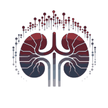

# Welcome to Halbritter Lab's GitHub Repository

## About us 🌐

Welcome to the Halbritter Lab, an research group led by Prof. Dr. med. Jan Halbritter. Our laboratory is part of the Charité - Universitätsmedizin Berlin, a renowned medical institution in Germany. The Halbritter Lab specializes in nephrology, internal medicine, and intensive care medicine, with a particular emphasis on rare kidney diseases.

## Contact us 📬
For more information about our research or to discuss potential collaborations, please contact Prof. Dr. med. Jan Halbritter at 
- 📧 jan.halbritter[at]charite.de

## Contributing to Our Repository 🤝

We welcome contributions from researchers and practitioners in the field of nephrology and related disciplines. If you are interested in contributing to our projects, please read our contribution guidelines.
Thank you for visiting the Halbritter Lab's GitHub repository. We look forward to collaborating with you in advancing nephrology research.

> Disclaimer: Any opinions expressed here are solely my own and do not reflect the views of my employer, funders, or their affiliates.